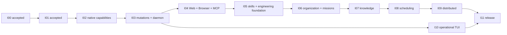

# MISHKAN Implementation and Acceptance Plan

**Status:** Proposed amendment — awaiting D-036
**Version:** 1.4
**Derived from:** Proposed PRD 1.4, SRS 1.6, Contract 1.4, Responsibility Map 1.2,
System Model 1.2, and Architecture 1.2

## 1. Purpose and gate authority

This post-architecture plan defines vertical delivery increments and their acceptance evidence. The
`SWE-BASICS-BEFORE-CODE` framework ends at Sequence 05; this plan does not invent another numbered
framework stage.

I00 and I01 remain accepted exactly as implemented and evidenced. Their code, historical commits,
and validation records are not rewritten. I02 remains paused until D-032 through D-036 accept the
complete documentary baseline. This proposed plan grants no production-code authority by itself.

## 2. Delivery laws

1. CrewAI 1.x is present in production from the walking skeleton and remains the sole runtime for
   agents and teams. There is no production runtime selector or competing `AgentRuntime`.
2. The persistent organization contains 59 professional identities; Mission Crews and task graphs
   are contextual. Free-form objectives do not require a finite outcome catalogue.
3. Mission templates, tools, skills, engines, environments, and packs are versioned inputs selected
   from project and execution-location evidence. They are never static workflows or authority.
4. MISHKAN deterministically owns application state, policy, effects, evidence, artifacts, and
   acceptance. Operational values remain public, versioned, configurable data.
5. Availability, discovery, instructions, and credentials confer no authority. A binding requires
   a concrete runnable adapter and policy decision for the actual target.
6. Commit, push, release, deployment, and migration are typed stateful capabilities, not universal
   prohibitions. Policy may allow, approval-gate, or deny their exact scope.
7. A policy-authorized native skill correction may activate immediately and reversibly. Staging is
   contextual; a newly discovered community extension remains a candidate until authorized.
8. Every increment ends in a runnable path and a red-capable acceptance test. Validation documents
   record only observed evidence after a real gate.
9. Final schema shapes, adapter products, dependency patches, benchmarks, and OS profiles are
   locked by their owning increment, not guessed in this baseline.
10. Every environment-dependent mission records an explicit environment decision. Containerization
    is never assumed: reuse, authorized host-native execution, generation, proposed project change,
    and unresolved dependency are all truthful outcomes.

## 3. Target repository boundaries

```text
MISHKAN/
├── AGENTS.md
├── pyproject.toml
├── uv.lock
├── src/mishkan/
│   ├── domain/          # contracts, identities, errors, invariants
│   ├── application/     # commands, queries, transaction orchestration
│   ├── organization/    # 59 profiles, branches, pools, templates
│   ├── missions/        # Mission Brief, crews, lifecycle, assignments
│   ├── conversations/   # channels, messages, decisions, escalations
│   ├── planning/        # execution-context-specific task plans and revisions
│   ├── crewai/          # sole production agent/team runtime integration
│   ├── policy/          # public policy and deterministic decisions
│   ├── registry/        # tools, engines, packs, adapters, availability
│   ├── environments/    # mission decisions, descriptor sets, materialization evidence
│   ├── capabilities/    # file, edit, process, shell, PTY, Web, Browser
│   ├── mcp/             # client, server facade, mediation, transports
│   ├── skills/          # SKILL.md, bundles, learning, lifecycle
│   ├── knowledge/       # attributed retrieval and degraded operation
│   ├── artifacts/       # immutable manifests and working references
│   ├── persistence/     # transactions, repositories, leases, outbox
│   ├── daemon/          # mishkand HTTP/OpenAPI, SSE, health
│   ├── scheduling/      # durable triggers and history
│   ├── worker/          # stateless remote execution
│   ├── cli/             # thin clients over application commands
│   └── sdk/             # typed Python client and public models
├── definitions/
│   ├── organization/v1/ # exact 59 persistent identities
│   ├── missions/        # optional versioned templates, never task graphs
│   ├── policies/        # public reference policies and profiles
│   ├── tools/           # native contracts and configured toolsets
│   ├── packs/           # contextual technical-pack definitions
│   └── schemas/         # exported versioned JSON Schemas
├── migrations/          # explicit engineer-executed migrations
├── deploy/              # Compose and release packaging
├── tui/                 # separate operational Go/Bubble Tea client
├── tests/               # unit, contract, integration, acceptance, fault, benchmark
└── docs/                # durable authority and observed evidence only
```

These are initial modular ownership boundaries, not service boundaries or permission grants.

## 4. Progressive Git delivery protocol

- Continue the active work on `feat/i02-policy-tools` without rewriting its existing history.
- Use `Y4NN777 <axel.studiesmail@gmail.com>` for every commit.
- Commit coherent behavior with its tests, run the narrow gate plus Ruff, format check, strict mypy,
  and `git diff --check`, then push the green checkpoint normally.
- Merge `topic → develop` only after the owning gate. Promote `develop → main` only after the
  integrated gate. Never merge a topic branch directly into `main`.
- Do not force-push unless the engineer explicitly authorizes a resolved history-repair target.
- MISHKAN's own Git effects still cross the same public capability policy; this protocol governs
  development of MISHKAN.

## 5. Accepted increments retained

### I00 — Contract-bearing foundation — accepted

The installable CLI, versioned configuration, provenance, stable errors, schema compatibility,
UUID/time contracts, and initial verification baseline remain accepted. See `docs/VALIDATION/I00.md`.

### I01 — Real local CrewAI walking skeleton — accepted

The real CrewAI/Ollama repository-bound initialization path, structured acceptance, durable state,
and repository-specific planning evidence remain accepted. See `docs/VALIDATION/I01.md`.

Neither increment is retroactively claimed to implement requirements introduced after its gate.

## 6. Rebaselined delivery increments

### I02 — Truthful native capabilities

**Runnable result:** A real CrewAI/Ollama task in each of multiple materially different repositories
can resolve and invoke bounded File/Read/Search, direct process, and full Bash capabilities through
the existing registry, policy, and effect gateway. Only adapters that actually execute may bind.
Large output is captured through the minimum immutable Artifact surface.

**Build scope:**

- retain the already tested registry, public policy, gateway, approval, and effect evidence;
- remove every binding whose adapter is abstract, missing, or unavailable at the execution location;
- implement file identity, metadata, listing, bounded reads, literal/glob/regex/structural search,
  provenance, partial coverage, symlink-safe resolution, and mutation-base evidence;
- implement direct process and full Bash semantics with explicit executable or command, arguments,
  working directory, environment delta, stdin, network, credentials, resource bounds, timeout,
  output bounds, declared effects, and settlement;
- add the minimum immutable artifact manifest/body path required when output exceeds bounded inline
  results;
- verify actual paths, symlinks, environment, network, credentials, Git/external effects, and
  uncertain completion without hardcoded private operational bans.

**Primary trace:** PLN-005–008, SAF-001–013, TOL-001–027, FIL-001–007, EXE-001–003,
TC-006.

**Gate:** two repository fixtures produce different exact bindings and native commands; a real
CrewAI/Ollama run succeeds locally; missing adapters never bind; forbidden resolved targets are
refused; secret canaries never persist; an uncertain stateful effect is not retried automatically.

### I03 — Mutations, sessions, artifacts, and durable daemon

**Runnable result:** An authorized mission can apply and verify recoverable change sets, operate PTY
and managed jobs, store complete artifacts, survive process loss, and resume through `mishkand`
from the first required result not accepted.

**Build scope:**

- implement structured edits and patches, exact base preconditions, recovery journals, verification,
  conditional rollback, command-driven mutation, and explicit Git effects;
- implement PTY and managed jobs with owner, readiness, cursors, signals, cancellation, deadlines,
  settlement, loss, and uncertainty;
- complete immutable artifacts, streaming, media validation, collections, compare-and-swap working
  references, retention, hold, garbage collection, missing-content recovery, and previews;
- introduce `mishkand`, short SQLAlchemy transactions, SQLite/WAL, explicit migrations, outbox,
  snapshots, resumable SSE, JSONL export, and typed application commands;
- complete task lifecycle, dependency release, bounded predicates, duplicate completion,
  cancellation, crash checkpoints, and deterministic resume.

**Primary trace:** SYS-006, RUN-004–005, RUN-007–012, EDT-001–008, EXE-004–008,
ART-001–008, OBS-001–008, NFR-003–004, TC-009.

**Gate:** crash during edit, artifact transfer, PTY/job execution, acceptance, and event delivery;
prove recovery without silent overwrite or repeated accepted effect, CAS conflict detection, cursor
gap detection, and at least 100 valid events per second on the reference environment.

### I04 — Web, Browser, MCP, and external harnesses

**Runnable result:** CrewAI tasks use typed Web and Browser surfaces and mediated MCP peers, while
external harnesses submit and inspect governed MISHKAN work through HTTP/OpenAPI or MCP without a
runtime or policy bypass.

**Build scope:**

- implement configured Web search, retrieval, extraction, crawl, cache, provenance, citation,
  redirects, network policy, SSRF protection, and truthful degradation;
- provide concrete adapters for the roles selected by configuration, including direct Brave search,
  SearXNG brokering, configured free search sources, HTTPX transport, configured extraction, and a
  configured crawler, without treating a component name as availability proof;
- implement Playwright browser sessions and Chrome DevTools diagnostics with observation-bound
  targets, origin checks, authenticated-state sensitivity, screenshots, and uncertain effects;
- implement MCP client, application server facade, and mediation over STDIO and Streamable HTTP,
  including identity, discovery, schema drift, progress, cancellation, reconnect, and long work;
- expose HTTP/OpenAPI, resumable SSE, and the non-authoritative local STDIO MCP bridge to compatible
  harnesses.

**Primary trace:** WEB-001–007, BRW-001–008, MCP-001–009, TC-008.

**Gate:** contract tests cover configured search roles, provenance, SSRF and redirect escapes,
authenticated browser state, stale observations, MCP schema drift, reconnect, cancellation, and
indeterminate external effects. A harness request reaches CrewAI only through an accepted
application command.

### I05 — Skills and Engineering Tools foundation

**Runnable result:** MISHKAN recognizes engineer/project/machine context, selects concrete
`SKILL.md` packages and technical packs progressively, applies policy-authorized live corrections,
and truthfully materializes representative development environments.

**Build scope:**

- implement confirmed engineer profile, privacy-safe project recognition, safe machine probes,
  independent observed states, provenance, configured community catalogues, and inspectable
  recommendations that never auto-activate;
- implement SKILL.md packages, Level 0 catalogue, Level 1 instructions, Level 2 references, bundles,
  contextual selection, hit/partial/miss evidence, slash invocation, and `/learn`;
- implement provenance, trust, configurable scans, quarantine, immediate/review/staged/deny policy,
  coherent live patch/edit, atomic activation, reset, archival, restoration, and crash recovery;
- implement engine discovery, adapter justification, independent availability states, technical
  packs, reproducible environment materialization, evidence adapters, and visible fallback;
- define and publish versioned `EnvironmentObservation`, `MissionEnvironmentDecision`,
  `EnvironmentBinding`, `EnvironmentDescriptorSet`, and `EnvironmentVerification` contracts with
  stable outcome, lifecycle, provenance, affected-task, and refusal semantics;
- discover project-owned environment evidence without mutation: Dev Container definitions,
  Containerfile/Dockerfile inputs, verified Compose files, Podman Kubernetes/Quadlet inputs, Nix or
  mise configuration, language manifests and lockfiles, CI setup, documented commands, target
  platforms, and safe engine/version probes;
- implement the decision outcomes `reuse_existing`, `host_native`, `generate`,
  `propose_project_change`, and `unresolved`, including multiple bindings for missions that span
  different repositories, services, platforms, or execution locations;
- implement independent versioned adapters for Development Container metadata and the selected
  conforming CLI; Podman detection plus Containerfile/Dockerfile build and bounded run behavior;
  and, only where required by the operation, Podman Kubernetes YAML or Quadlet. Treat Compose as a
  separate compatibility binding whose concrete provider must be observed and verified;
- generate the smallest mission-specific descriptor set as immutable artifacts and optional typed
  Edit/Patch change sets. Preserve base revisions, target platform/architecture, base-image
  identity, build context, features/dependencies, mounts, user model, network/resources,
  credential references, lifecycle commands, cleanup, and compatibility limits when applicable;
- verify parse/schema validity, acquisition or build, startup/readiness, workspace access,
  dependency availability, representative project commands, artifacts, cleanup, and repeatability
  at the intended location. Preserve logs, image identities, effects, timing, limitations, and
  `verified`, `failed`, `cancelled`, or `uncertain` settlement;
- prove that existing project definitions are reused when compatible and cannot be overwritten by
  generation alone; project persistence must cross I03 Edit/Patch while build/start/probe/cleanup
  crosses I03 Terminal/Process or a justified typed adapter;
- accept project commands as Terminal/Process inputs and provide representative fixtures for Go,
  JavaScript/TypeScript, Java/Kotlin, Android, Python, Rust, C, and Swift.

**Primary trace:** CTX-001–008, SKL-001–025, ENG-001–013.

**Gate:** a project-specific missing procedure can yield a Research-authored candidate; effective
policy can activate a safe native correction immediately or require review; a community candidate
cannot self-install; every fixture proves actual engine/environment state or an honest unsupported
result; restoration is byte-identical and retains evidence. Environment acceptance additionally
uses at least: one existing Dev Container reused without mutation; one greenfield descriptor set
generated and verified; one Podman Containerfile build and bounded run on a compatible worker; one
multi-service or lifecycle fixture that either proves its selected Compose/Podman adapter or
truthfully refuses it; one incompatible platform; one secret-reference case; one stale-base
conflict; one build interruption with non-fabricated settlement; and one cleanup/re-run proving the
declared reproducibility boundary.

### I06 — Organization, missions, communication, and professional evolution

**Runnable result:** PM and CTO agents turn a free-form CEO objective into a Mission Brief, compose a
temporary crew from the 59 persistent identities, coordinate CrewAI work through independent
assurance and reporting, converse durably, and process rare governed CEO interventions.

**Build scope:**

- load the exact SRS roster from versioned professional definitions with explicit branches, pools,
  independence, authority, and profile evidence;
- implement free-form mission origins, optional templates, Mission Briefs, crew revisions,
  accountable assignments, lifecycle, PM/CTO agreement, scoped disagreement, and CEO escalation;
- add environment intent to the Mission Brief and require a versioned mission environment decision
  before dependent tasks become eligible. PM confirms product/developer-experience needs, CTO
  confirms platform, security, quality, and operability coverage, and the Mission Lead tracks the
  decision as a plan dependency rather than selecting a container format by role;
- support per-context environment bindings inside one mission; expose reused definitions,
  generated descriptor artifacts, proposed project change sets, verification evidence,
  degradation, and affected tasks through mission inspection and conversations;
- when repository revision, platform, required engine, policy, or mission scope invalidates a
  binding, create a new environment and plan revision, preserve prior evidence, and pause only
  tasks that depend on the invalid binding;
- support greenfield, existing, multi-repository, product, research, incident, modernization,
  platform, and operational missions without a fixed workflow catalogue;
- implement Executive, Mission, Branch, and authorized Direct conversations; separate messages,
  events, commands, decisions, escalations, and notifications;
- implement comment, answer, approve/reject, pause, resume, reassign, stop, and risk-accept commands
  with full attribution and client parity;
- implement evidence-based professional evolution without self-certification, authority change,
  independence change, or failure erasure;
- expose `org`, `mission`, `conversation`, `intervention`, and `advisory` through CLI, SDK, HTTP, and
  MCP application contracts.

**Primary trace:** PRJ-008–010, PLN-012–020, ORG-001–016, MSN-001–016.

**Gate:** materially different mission fixtures produce different Briefs, crews, plans, tools, and
evidence; PM/CTO disagreement pauses only dependent work and pings the CEO; producer/evaluator and
orchestrator/reporter conflicts are rejected; a restart preserves the Executive conversation and
an authorized intervention has identical TUI-independent API semantics. Greenfield,
existing-project, multi-repository, and platform-specific fixtures produce different environment
decisions; no dependent task starts from a generated-but-unverified descriptor; and a binding
revision pauses only its dependent task set.

#### Environment delivery boundary across increments

| Increment | Environment responsibility | Acceptance boundary |
|---|---|---|
| I02 | Read project evidence and execute bounded direct/Bash probes | No environment generation or mutation is claimed |
| I03 | Supply immutable artifacts, Edit/Patch change sets, jobs, recovery, and durable events | Descriptor bytes and effects can be stored, applied, observed, and recovered truthfully |
| I05 | Resolve engines and context; decide, generate, materialize, verify, and settle environment bindings | The environment capability works independently on representative fixtures |
| I06 | Make the decision a required mission-plan dependency and expose it to PM, CTO, crews, and clients | Environment-dependent mission tasks cannot outrun their verified binding |
| I09 | Re-resolve and verify bindings against advertised remote-worker location and immutable envelope evidence | A local verification is never reused as proof for an incompatible worker |
| I11 | Expand platform/version fixtures, benchmarks, fault tests, packaging, and operational guidance | Supported combinations are published only from measured conformance evidence |

I05 MUST NOT invent its own file mutation, process lifecycle, artifact store, policy, or mission
runtime. I06 MUST NOT infer an environment from an agent role or optional mission template. The
only cross-increment identity is the versioned mission environment decision and its referenced
artifacts, change sets, adapter evidence, and plan dependencies.

### I07 — Attributed knowledge and degraded operation

**Runnable result:** The intent router selects literal repository evidence, mem0 episodic memory,
Cognee semantic knowledge, or Graphify structure with source and staleness, while safe work
continues visibly when optional services fail.

**Build scope:** implement versioned self-hosted mem0 and Cognee clients; integrate Graphify through
its supported CLI/MCP surface; add scan and incremental refresh, intent routing, attribution,
staleness, miss evidence, timeouts, promotion decisions, and local Compose profiles using configured
Ollama routes rather than paid dependencies.

**Primary trace:** KNW-001–006.

**Gate:** current API contract tests, incremental graph evidence, cheapest-compatible selection,
and useful degraded execution with all optional knowledge services unavailable.

### I08 — Persistent headless scheduling

**Runnable result:** A timezone-aware scheduled mission survives daemon restart, creates at most one
run per occurrence, respects overlap policy, and can be invoked through generated OS scheduler
definitions.

**Build scope:** pin a verified stable APScheduler 3.11.x patch; implement persistent jobs, IANA
timezone validation, one-shot and five-field cron, run-now, pause, resume, remove, history,
coalescing, configurable misfire/retry/backoff, overlap decisions, and exports for cron, systemd,
and launchd against the same idempotent run command.

**Primary trace:** AUT-001–007.

**Gate:** restart, duplicate trigger, timezone rejection, overlap, misfire, retry, history, and
equivalent internal/OS-triggered invocation tests.

### I09 — Distributed execution

**Runnable result:** At least two stateless workers execute immutable envelopes with individual mTLS
identity; loss of one expires its lease and recovers work while exactly one completion is accepted.

**Build scope:** require PostgreSQL and shared blob storage; implement short-lived one-time
enrollment, certificate issue/rotation/revocation, capabilities, heartbeats, leases, idempotent
claims, immutable envelopes, revision checks, artifacts/patch results, loss recovery, duplicates,
timeouts, and partial-network reconciliation.

**Primary trace:** DST-001–010.

**Gate:** Compose-based two-worker tests prove individual revocation, revision mismatch refusal,
worker loss recovery, expired lease behavior, duplicate completion containment, and exactly-once
accepted result semantics.

### I10 — Operational Go/Bubble Tea TUI

**Runnable result:** `mishkan watch` provides live organization-to-task drill-down and can issue the
same authorized interventions as other clients while staying responsive, bounded, and recoverable.

**Build scope:** implement Overview, Missions/Runs, Agents, Teams/Branches, Conversations/Events,
Knowledge, Security, and Schedules views; snapshot plus SSE, filtering/search, compact layout,
bounded history, reconnect/backoff, offline status, accessible help, and explicit command
confirmation. Every mutation calls the application API and owns no local authority.

**Primary trace:** NFR-006, TC-004.

**Gate:** Bubble Tea routing, resize, filtering, bounded buffers, reconnect, daemon restart, event
burst, golden snapshots, complete drill-down, and command-parity contract tests.

### I11 — Complete packs, hardening, and release

**Runnable result:** Linux and macOS Python packages, daemon/worker images, and Go TUI binaries pass
repeatable security, reliability, performance, packaging, migration, and recovery gates with SBOMs
and signed artifacts.

**Build scope:** complete technical packs without making them mandatory; lock supported dependency
patches and OS profiles from evidence; run branch coverage, contract/E2E modes, benchmarks, fault
injection, dependency and secret scanning; publish packages, images, binaries, SBOMs, signatures,
upgrade/migration guidance, and operational runbooks. Database migrations remain engineer-executed.

**Primary trace:** NFR-001, NFR-005, NFR-008–010, TC-005.

**Gate:** Python 3.11–3.13 Linux/macOS matrices, at least 80 percent branch coverage for the named
critical modules, startup/event/advisory gates, secret containment, process/service/network fault
tests, verified SBOM/signatures, and clean backup/restore and explicit migration rehearsals.

## 7. Dependency and release order



I10 may begin only after I03 stabilizes snapshot, SSE, and application-command contracts. It may
then progress alongside I04–I09. Every increment is independently runnable and accepted before
promotion; distributed execution does not weaken the local gate.

## 8. Complete SRS-to-increment ownership

Each requirement has exactly one primary accepting increment. Cross-cutting invariants still apply
to every affected gate.

| Increment | Primary SRS requirements |
|---|---|
| I00 | SYS-001–005, SYS-007, NFR-007 |
| I01 | PRJ-001–007, PLN-001–004, PLN-009–011, RUN-001–003, RUN-006, NFR-002, TC-001–003, TC-007 |
| I02 | PLN-005–008, SAF-001–013, TOL-001–027, FIL-001–007, EXE-001–003, TC-006 |
| I03 | SYS-006, RUN-004–005, RUN-007–012, EDT-001–008, EXE-004–008, ART-001–008, OBS-001–008, NFR-003–004, TC-009 |
| I04 | WEB-001–007, BRW-001–008, MCP-001–009, TC-008 |
| I05 | CTX-001–008, SKL-001–025, ENG-001–013 |
| I06 | PRJ-008–010, PLN-012–020, ORG-001–016, MSN-001–016 |
| I07 | KNW-001–006 |
| I08 | AUT-001–007 |
| I09 | DST-001–010 |
| I10 | NFR-006, TC-004 |
| I11 | NFR-001, NFR-005, NFR-008–010, TC-005 |

## 9. Gate decisions

1. D-032 accepts PRD 1.4 and SRS 1.6.
2. D-033 accepts Contract 1.4.
3. D-034 accepts Responsibility Map 1.2.
4. D-035 accepts System Model 1.2 and Architecture 1.2 and supersedes D-030.
5. D-036 accepts this plan and explicitly authorizes resumption of I02.

Until all five decisions are accepted, the four documentation commits are review artifacts and no
production code changes. Approval of D-032 through D-035 does not implicitly approve D-036.
