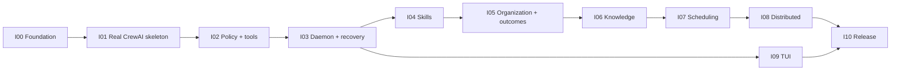

# MISHKAN Implementation and Acceptance Plan

**Status:** Draft — delivery-plan review

**Version:** 0.1

**Derived from:** PRD 1.2, SRS 1.3, Contract 1.2, Responsibility Map 1.0,
System Model 1.0, Architecture 1.0, and accepted decisions D-001–D-022

## 1. Purpose and authority

This is the post-architecture delivery plan. The `SWE-BASICS-BEFORE-CODE` framework ends at
Sequence 05; this document does not invent another framework stage. It defines implementation
increments, their dependency order, and the evidence required to accept each increment.

Until this plan is accepted and the engineer explicitly authorizes coding, it creates no permission
to scaffold or implement the system.

## 2. Delivery laws

1. **CrewAI is present in the first executable slice.** Supported CrewAI 1.x is the only production
   agent, task, crew, process, flow, and model tool-calling runtime. There is no production runtime
   selector and no MISHKAN-owned competing workflow engine.
2. **Planning is repository-specific.** Stable outcome definitions declare goals, constraints, and
   completion contracts. A CrewAI planning crew proposes the task graph from the objective,
   repository evidence, organization, skills, tools, and effective policy; deterministic MISHKAN
   boundaries validate and accept or reject it.
3. **Configuration is data, not hidden code.** Provider routes, endpoints, policy rules, tool
   sources, toolsets, timeouts, retries, resource limits, path scopes, schedule behavior, worker
   enrollment lifetime, and isolation profiles are public versioned inputs. System invariants are
   explicit contracts, never a private deny-list.
4. **Availability does not grant authority.** Skills and tools may be discovered without becoming
   eligible. Exact accepted plan and policy fingerprints govern every binding and effect.
5. **Stateful work is controllable.** Commit, push, release, deployment, and migration are normal
   typed capabilities whose exact scope is `allow`, `require_approval`, or `deny`.
6. **Every increment is vertical.** It ends in a runnable path and a red-capable acceptance test,
   not merely a collection of internal classes.
7. **Evidence follows execution.** Planned tests live with code. `docs/VALIDATION` receives only
   observed results from an actual gate; it never contains speculative checklists.

## 3. Proposed implementation baseline

Plan acceptance approves the following baseline. Exact dependency patches are locked when the
owning increment begins and are upgraded only through reviewed lockfile changes.

| Area | Baseline |
|---|---|
| Core language | Python 3.11–3.13 |
| Packaging | `uv`, one root `pyproject.toml`, reproducible lockfile |
| Runtime | Supported CrewAI `>=1,<2`; deterministic executor doubles exist only in tests |
| Contracts | Pydantic 2 models plus exported JSON Schema |
| CLI / daemon | Typer client surfaces; FastAPI/ASGI `mishkand` |
| Persistence | SQLAlchemy 2 repositories; SQLite/WAL non-distributed; PostgreSQL distributed; explicit Alembic migrations |
| Scheduling | APScheduler `>=3.11,<4`, locked to a stable 3.11.x patch, with persistent SQLAlchemy jobs |
| HTTP clients | `httpx` with versioned request/result adapters |
| Local isolation | Configured Docker or Podman adapter; no runtime is silently assumed |
| TUI | Separate Go module using current stable Bubble Tea, Bubbles, and Lipgloss releases locked by `go.mod` |
| Verification | pytest, branch coverage, Ruff, strict mypy, contract/E2E suites, Go tests, and fault-injection scripts |

CrewAI's current documentation describes agents, tasks, crews, processes, flows, structured outputs,
and tools as its supported coordination surface. MISHKAN therefore resolves model routes into
CrewAI-supported LLM configuration; it does not implement a parallel `ProviderTransport` that calls
models outside CrewAI.

## 4. Planned repository shape

```text
MISHKAN/
├── AGENTS.md
├── pyproject.toml
├── uv.lock
├── src/mishkan/
│   ├── domain/          # versioned contracts, invariants, identities, errors
│   ├── application/     # use cases composed from responsibility-owned ports
│   ├── crewai/          # sole production coordination integration
│   ├── policy/          # public policy parsing and deterministic decisions
│   ├── tools/           # registry, binding, enforcement, native/MCP adapters
│   ├── skills/          # discovery, loading, trust, learning, lifecycle
│   ├── knowledge/       # attributed context routing and clients
│   ├── persistence/     # repositories, transactions, leases, outbox
│   ├── daemon/          # /v1 HTTP, SSE, health, schedules, worker endpoints
│   ├── worker/          # stateless remote execution process
│   ├── cli/             # thin CLI over the same application commands/API
│   └── sdk/             # typed Python client and public models
├── definitions/
│   ├── organization/v1/ # 32 versioned role definitions
│   ├── outcomes/v1/     # 15 adaptive outcome contracts, not static task chains
│   ├── policies/        # inspectable reference policies and profiles
│   ├── tools/           # bundled tool contracts and toolsets
│   └── schemas/         # exported versioned JSON Schemas
├── migrations/          # generated plans; application remains policy-governed
├── deploy/              # Compose and release packaging
├── tui/                 # separate Go/Bubble Tea read-only client
├── tests/               # unit, contract, integration, acceptance, fault, benchmark
└── docs/                # durable authority and observed evidence only
```

These paths are ownership boundaries for the initial modular control plane. They are not permission
to duplicate domain rules between folders or split modules into services.

## 5. Progressive Git delivery protocol

- Use one implementation branch per increment: `impl/i00-foundation` through
  `impl/i10-release`.
- Commit a coherent behavior plus its tests together. Avoid one giant phase commit and avoid
  mechanical commit noise.
- Before each push, run the narrow affected test gate, Ruff, strict mypy, and `git diff --check`.
- Push after every green checkpoint so work is recoverable and reviewable. Merge an increment only
  after its full acceptance gate passes.
- Use `Y4NN777 <axel.studiesmail@gmail.com>` for every commit.
- Do not rewrite or force-push shared implementation history except for an explicitly authorized
  history-repair operation with the exact target resolved first.
- A generated migration, deployment, commit, or push performed by MISHKAN itself still passes the
  same public capability policy; this Git protocol governs development of MISHKAN.

## 6. Delivery increments

### I00 — Contract-bearing foundation

**Runnable result:** The installable Python CLI loads a versioned configuration, reports provenance
without secrets, validates persisted-schema compatibility, and exposes stable error envelopes.

**Build scope:**

- create the Python package, dependency lock, test matrix, and module-import boundaries;
- implement UUID and UTC/IANA-time contracts, error catalogue, schema-version registry, and JSON
  Schema export;
- implement layered YAML configuration and environment/secret references with local, cloud, and
  hybrid presets;
- expose `mishkan config setup|show|set|validate` with warning-only connection probes;
- add CI for Python 3.11–3.13 on Linux and macOS without claiming release support yet.

**Primary trace:** SYS-001–005, SYS-007, NFR-007, TC-001–003.

**Acceptance gate:**

```bash
uv run pytest tests/acceptance/i00_foundation
uv run ruff check .
uv run mypy --strict src
uv run mishkan --config tests/fixtures/config/local-valid.yaml config validate
! uv run mishkan --config tests/fixtures/config/unsupported-schema.yaml config validate
```

The second validation command must fail with `ERR-VER-001`; secret canaries must be absent from all
captured output.

### I01 — Real local CrewAI walking skeleton

**Runnable result:** `mishkan init` binds a real repository revision, discovers evidence, asks a
CrewAI planning crew for a repository-specific read-only initialization plan, validates it, runs it
through CrewAI using local Ollama, accepts a structured result, and resumes from durable SQLite
state without a paid API.

**Build scope:**

- bind repository identity and immutable base revision; preserve cited discovery facts and unknowns;
- load a minimal versioned test organization and outcome contract, then materialize the accepted
  plan through supported CrewAI Agents, Tasks, Crews, Processes, and Flows;
- resolve local/cloud/hybrid model routes for Ollama, OpenAI-compatible endpoints, Anthropic, and
  Bedrock into CrewAI LLM configuration with configured credential pools and fallback; local
  acceptance uses Ollama;
- introduce the smallest read-only tool contract and policy needed for discovery through the same
  registry, binding, and enforcement shape later tools will extend;
- persist plan, task, result, acceptance, and outbox records in SQLite/WAL;
- prove that changing repository evidence changes the generated task graph while preserving the
  outcome contract.

**Primary trace:** PRJ-001–007, PLN-001–004, PLN-009–011, RUN-001–003, RUN-006,
NFR-002, TC-007.

**Acceptance gate:**

```bash
uv run pytest tests/acceptance/i01_local_crewai -m ollama
uv run pytest tests/golden/test_repository_specific_plans.py
uv run pytest tests/contract/test_crewai_boundary.py
```

The gate must demonstrate a real CrewAI execution, two different plans for materially different
repository fixtures, no production test-double selection, and no paid service call.

### I02 — Public policy, tools, and governed effects

**Runnable result:** A CrewAI task can discover and call only its exact bound native or MCP tool;
filesystem, command, network, credential, Git, release, deployment, and migration effects obey a
public versioned `allow`/`require_approval`/`deny` decision and emit non-secret evidence.

**Build scope:**

- implement deterministic policy precedence, approval, revocation, fingerprints, and policy
  evolution without a private action deny-list;
- implement Level 0 tool metadata, deferred full-schema loading, namespaces, collision handling,
  nested toolsets, immutable snapshots, availability, and CrewAI tool representations;
- implement invocation/result envelopes, schema validation, actual target resolution, symlink-safe
  workspace scopes, late credentials, output inspection, cancellation, and uncertain effects;
- add configured Docker/Podman isolation profiles. The reference profile may declare no network,
  30 seconds, and 512 MB, but those are visible policy values rather than code constants;
- model commit, push, deployment, release, and migration as typed adapters with exact repository,
  remote, branch, environment, and approval scopes;
- implement MCP session lifecycle and bound-schema drift refusal.

**Primary trace:** PLN-005–008, SAF-001–013, TOL-001–025, NFR-005, NFR-010, TC-006.

**Acceptance gate:**

```bash
uv run pytest tests/acceptance/i02_policy_tools
uv run pytest tests/security -m "paths or symlinks or secrets or commands or unicode"
uv run pytest tests/contract/tools
uv run pytest tests/acceptance/test_stateful_capability_policy.py
```

The gate must prove that policy—not an action name—permits, gates, or refuses the same stateful tool,
and that an uncertain effect is not automatically repeated.

### I03 — Durable daemon, recovery, and observation

**Runnable result:** `mishkand` owns the same application commands as the CLI/SDK, persists current
state and outbox facts atomically, resumes after forced process loss, and provides `/v1` snapshots
plus resumable SSE without losing authoritative progress.

**Build scope:**

- add SQLAlchemy repositories, explicit Alembic migration commands, transactional outbox delivery,
  JSONL export, retention, and protected evidence holds;
- implement full task lifecycle, barriers, bounded loops using the restricted predicate DSL,
  structured-output retry, cancellation, duplicate completion, and first-failed-task resume;
- realize the six composition primitives through supported CrewAI Processes and Flows: sequential,
  hierarchical delegation, parallel fan-out/barrier, conditional routing, bounded iteration, and
  evaluator-feedback iteration. Outcome definitions select a primitive but never embed a universal
  task chain;
- implement versioned `/v1` health, runs, task state, snapshot, event query, and SSE endpoints;
- expose typed Python SDK clients and CLI parity, including `workflow`, `events`, `status`, progress,
  filters, `--quiet`, and security audit views;
- keep model execution, external effects, projections, and delivery outside short transactions.

**Primary trace:** SYS-006, RUN-004–005, RUN-007–012, OBS-001–008, NFR-003–004.

**Acceptance gate:**

```bash
uv run pytest tests/acceptance/i03_daemon_recovery
uv run pytest tests/golden/workflow_patterns
uv run pytest tests/fault/test_process_loss.py tests/fault/test_event_transport_loss.py
uv run python tests/bench/event_ingestion.py --minimum-rate 100 --duration 60
```

The gate must kill the daemon during execution and prove deterministic recovery from the first
unaccepted task, durable acceptance before dependency release, cursor gap detection, and at least
100 accepted events per second.

### I04 — Hermes-inspired skills and learning

**Runnable result:** An authorized CrewAI task discovers skill metadata, progressively loads
`SKILL.md` and referenced content, records hit/partial/miss, and can produce a staged Research-team
skill proposal that becomes active only through a separate policy-authorized approval.

**Build scope:**

- implement bundled, project, operator-managed external, and configured community sources with
  deterministic precedence and provenance locks;
- implement Level 0 catalogue, Level 1 full `SKILL.md`, Level 2 on-demand references, slash
  invocation, bundles, applicability, compatibility, and dependency validation;
- scan provenance, prompt injection, destructive content, credential patterns, Unicode smuggling,
  and configured PII rules; quarantine failures with non-secret evidence;
- implement restart-safe staged create/patch/edit/delete, atomic activation, pinning, update, reset,
  archive, restoration, and curation;
- implement `/learn`, miss thresholds, and Research-team authored proposals without self-activation;
- support GitHub, URL, and configured hub sources without operating a hosted marketplace.

**Primary trace:** SKL-001–025.

**Acceptance gate:**

```bash
uv run pytest tests/acceptance/i04_skills
uv run pytest tests/security/test_malicious_skills.py
uv run pytest tests/fault/test_skill_activation_crash.py
```

The gate must prove progressive disclosure, quarantine, restart-safe staging, separate proposal and
activation identities, and byte-identical restoration of the prior active skill.

### I05 — Complete organization, adaptive outcomes, and sprint lifecycle

**Runnable result:** The approved 32-role organization and 15 stable outcomes load from versioned
definitions. A sprint compiles repository-specific frontend, backend, or infrastructure plans and
cannot succeed until independent downstream evaluation and reporting are accepted.

**Build scope:**

- define exactly the SRS roster and outcome catalogue with roles, delegation eligibility, tool and
  skill eligibility, path scopes, tier needs, and structured contracts;
- validate role separation before CrewAI materialization and again at result acceptance;
- implement adaptive outcome constraints rather than fixed task lists;
- implement separate production, QA/evaluation, and Reporter tasks with versioned result schemas;
- add sprint initialization, active work, blockers, findings, candidates, and close state;
- complete `org`, `workflow`, `sprint`, `advisory`, and reporting CLI/SDK surfaces.

**Primary trace:** ORG-001–012.

**Acceptance gate:**

```bash
uv run pytest tests/acceptance/i05_organization
uv run pytest tests/golden/test_organization_catalogue.py
uv run pytest tests/acceptance/test_independent_quality_chain.py
```

The gate must reject producer/evaluator and orchestrator/reporter conflicts and show two
repositories receiving different task graphs for the same named outcome.

### I06 — Attributed knowledge and degraded operation

**Runnable result:** The PreToolUse context router selects literal repository reads, mem0 episodic
memory, Cognee semantic knowledge, or Graphify structural knowledge; every answer carries source and
staleness, and every optional-service outage degrades without stopping safe work.

**Build scope:**

- integrate self-hosted mem0 OSS without a hosted `/v1` prefix, Cognee under `/api/v1`, and Graphify
  through its CLI/MCP stdio or shared HTTP server rather than an imagined REST API;
- implement query classification, cheapest-capable routing, attribution, staleness, miss evidence,
  configured timeouts, promotion approval, and degraded events;
- trigger a Graphify scan during `mishkan init` and incremental refresh later;
- provide `deploy/docker-compose.local.yaml` with configurable host mappings whose reference profile
  uses mem0 7776, Cognee 7777, Graphify MCP 7778, and `mishkand` 8888;
- validate a no-paid-service local profile. Ollama compatibility for each knowledge service is
  contract-tested rather than assumed; any required compatibility adapter remains explicit config.

**Primary trace:** KNW-001–006.

**Acceptance gate:**

```bash
docker compose -f deploy/docker-compose.local.yaml up -d
uv run pytest tests/contract/knowledge -m self_hosted
uv run pytest tests/acceptance/i06_context_routing
uv run pytest tests/fault/test_all_knowledge_services_down.py
```

The gate must verify mem0 and Cognee path contracts, Graphify MCP negotiation, source attribution,
incremental graph refresh, and useful degraded execution with all three services unavailable.

### I07 — Headless scheduling and unattended operation

**Runnable result:** A persistent timezone-aware schedule survives daemon restart, maps one trigger
occurrence to at most one run, prevents unauthorized overlap, and can be managed internally or
invoked through an exported OS scheduler definition.

**Build scope:**

- integrate stable APScheduler 3.11.x with persistent SQLAlchemy jobs and MISHKAN schedule records;
- support one-shot and five-field cron triggers, IANA timezone validation, run-now, pause, resume,
  remove, history, coalescing, misfire handling, and bounded retry;
- make overlap, misfire grace, retry, and backoff public policy/configuration values; the reference
  profile may use 10 minutes and two exponential-backoff retries;
- implement `/v1/schedules` and `mishkan schedule export --target cron|systemd|launchd` against the
  same idempotent run API.

**Primary trace:** AUT-001–007.

**Acceptance gate:**

```bash
uv run pytest tests/acceptance/i07_scheduling
uv run pytest tests/fault/test_scheduler_restart.py
uv run pytest tests/contract/test_scheduler_exports.py
```

The gate must prove schedule persistence, duplicate-trigger suppression, timezone rejection,
overlap decisions, and equivalent internal/external invocation.

### I08 — PostgreSQL and bounded distributed execution

**Runnable result:** Two stateless workers execute immutable CrewAI task envelopes over individually
authenticated mTLS connections; loss of one worker expires its lease and recovers the task while
accepting at most one completion.

**Build scope:**

- activate distributed mode only with PostgreSQL and explicit shared coordination configuration;
- implement single-use configured-short-lived enrollment tokens, per-worker certificate issue,
  rotation, heartbeat, revocation, capability/resource advertisement, and health;
- implement idempotent claims, renewable leases, immutable envelopes, repository revision checks,
  result/artifact/patch return, duplicate delivery, and reconciliation of uncertain network state;
- ensure workers cannot plan, self-authorize, commit, push, deploy, or migrate unless the exact
  coordinator-issued envelope and effective policy grant that capability;
- add `/v1/workers`, enrollment, claim, heartbeat, and completion endpoints plus `mishkan worker`
  administration.

**Primary trace:** DST-001–010.

**Acceptance gate:**

```bash
docker compose -f deploy/docker-compose.distributed-test.yaml up --build --abort-on-container-exit
uv run pytest tests/acceptance/i08_two_workers -m distributed
uv run pytest tests/fault/test_worker_loss.py tests/fault/test_partial_network.py
```

The gate must show worker-specific revocation, revision mismatch refusal, lease recovery, stale
completion rejection, and exactly one accepted completion.

### I09 — Read-only Go/Bubble Tea monitor

**Runnable result:** `mishkan watch` renders live local and distributed state across Overview, Runs,
Agents, Teams, Events, Knowledge, Security, and Schedules, remains responsive during bursts, and
recovers after daemon restart without acquiring mutation authority.

**Build scope:**

- create a separate Go client consuming `/v1/snapshot` and resumable SSE;
- use one flat main model for active tab, dimensions, connection state, filters, and the bounded
  event ring; give each composable tab submodel ownership of its table/list and detail viewport;
- make `Init` request the initial snapshot and subscribe asynchronously; route key, resize,
  snapshot, event, reconnect, and error messages through `Update`, batch commands, and never block
  the update loop;
- use Bubbles list/table, viewport, spinner/progress, help, and Lipgloss responsive layout;
- implement keyboard navigation, search/filtering, bounded buffers, reconnect backoff, offline
  state, and compact layout below 80 columns;
- keep all operational mutations in explicit Python CLI/SDK commands.

**Primary trace:** NFR-006. This increment supplies the monitor portion of TC-004, whose complete
interface-scope conformance is accepted in I10.

**Acceptance gate:**

```bash
cd tui && go test ./...
cd tui && go test ./... -run 'TestGolden|TestReconnect|TestBoundedBuffer|TestResize'
uv run pytest tests/contract/test_tui_snapshot_sse.py
```

The gate must include golden renderings at narrow and wide sizes plus a burst/reconnect test with a
strictly bounded event buffer.

### I10 — Cross-cutting hardening and release

**Runnable result:** Reproducible Python packages, daemon/worker images, and Go binaries pass the
full conformance, security, reliability, and performance gates on Linux and macOS with signed
artifacts and documented recovery.

**Build scope:**

- complete branch coverage, contract suites, Compose E2E modes, benchmarks, and repeatable process,
  optional-service, event-transport, worker, and network fault injection;
- verify CLI groups: `config`, `workflow`, `sprint`, `memory`, `knowledge`, `code-graph`, `events`,
  `security`, `advisory`, `org`, `skills`, `bundles`, `schedule`, `worker`, `status`, `init`, `watch`;
- publish SBOMs, dependency scans, signed Python distributions, container images, and Go binaries;
- add upgrade, migration, backup, recovery, enrollment, revocation, and incident runbooks only after
  their real commands and environments exist;
- verify schema migrations are never implicit and remain configurable capability operations with
  evidence and approval support.

**Primary trace:** NFR-001, NFR-008–009 and the complete conformance of TC-004–005.

**Acceptance gate:**

```bash
uv run pytest --cov=mishkan --cov-branch --cov-fail-under=80
uv run pytest tests/contract tests/integration tests/acceptance tests/security tests/fault
uv run python tests/bench/run_all.py
cd tui && go test ./...
```

Release additionally requires clean Linux/macOS build matrices for Python 3.11–3.13, startup within
10 seconds, the required advisory and knowledge latency gates or their safe fallbacks, secret-free
diagnostics, verified SBOMs, and signature verification.

## 7. Dependency and release order



I09 may begin after the snapshot/SSE contract is stable in I03 and can proceed alongside I04–I08.
Distributed work remains post-core: I00–I07 must pass locally before I08 begins.

## 8. Requirement coverage summary

| Increment | Primary requirement ranges |
|---|---|
| I00 | SYS-001–005, SYS-007, NFR-007, TC-001–003 |
| I01 | PRJ-001–007, PLN-001–004, PLN-009–011, RUN-001–003, RUN-006, NFR-002, TC-007 |
| I02 | PLN-005–008, SAF-001–013, TOL-001–025, NFR-005, NFR-010, TC-006 |
| I03 | SYS-006, RUN-004–005, RUN-007–012, OBS-001–008, NFR-003–004 |
| I04 | SKL-001–025 |
| I05 | ORG-001–012 |
| I06 | KNW-001–006 |
| I07 | AUT-001–007 |
| I08 | DST-001–010 |
| I09 | NFR-006 |
| I10 | NFR-001, NFR-008–009, complete TC-004–005 conformance |

Every SRS requirement category is assigned a primary accepting increment. Contract promises,
invariants, error behavior, and responsibility ownership remain cross-cutting acceptance inputs;
an increment cannot claim acceptance by satisfying only the range in this summary.

## 9. Compatibility risks to retire in their owning increment

- **CrewAI:** verify supported 1.x Flow persistence, structured output, tool wrapping, callbacks, and
  cancellation behavior against contract tests before expanding the organization catalogue.
- **Local knowledge stack:** verify the current self-hosted mem0 and Cognee releases can use the
  declared local inference/embedding route without a paid dependency; make incompatibility visible
  instead of silently calling a cloud service.
- **Graphify:** use the supported CLI for scans and stdio/shared-HTTP MCP for queries; never build an
  imagined Graphify REST client.
- **APScheduler:** stay on stable 3.11.x while 4.x remains outside the accepted line; isolate its job
  representation from MISHKAN's authoritative schedule contract.
- **SQLite to PostgreSQL:** run every repository and lease contract suite against both engines before
  distributed mode is accepted.
- **External effects:** fault injection must cover response loss after a real effect, because this is
  the point at which naive retries can duplicate state.

Official compatibility baselines are rechecked when their increment begins:

- [CrewAI documentation](https://docs.crewai.com/index)
- [APScheduler releases](https://pypi.org/project/APScheduler/)
- [mem0 self-hosted OSS API](https://docs.mem0.ai/open-source/features/rest-api)
- [Cognee API reference](https://docs.cognee.ai/api-reference/introduction)
- [Graphify MCP tools](https://graphify.com/docs/mcp-tools)

## 10. Plan approval gate

Approval of this document will:

1. accept the implementation baseline, repository shape, increments, and Git delivery protocol;
2. close delivery-planning decision D-023;
3. permit implementation only after a separate explicit instruction to begin coding.

Any material change to CrewAI's role, persistence authority, public policy semantics, repository-
specific planning, or responsibility ownership requires an updated accepted decision before code
continues.
