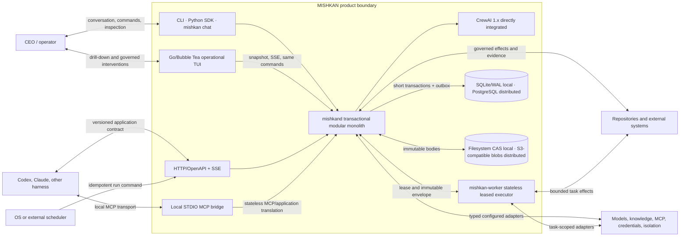
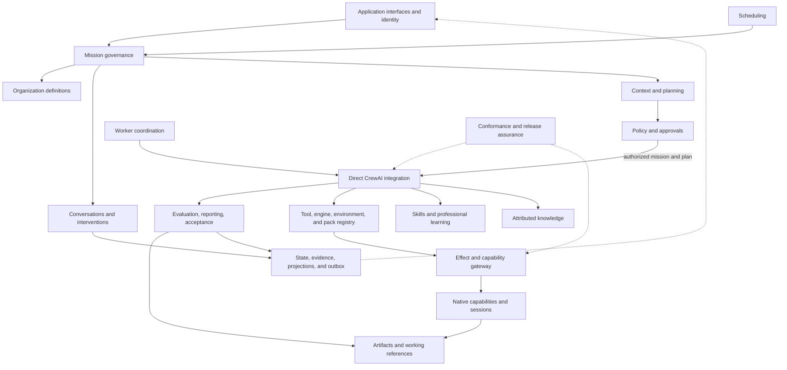

# MISHKAN Architecture

**Status:** Proposed amendment — awaiting D-035
**Version:** 1.2
**Derived from:** Proposed System Model 1.2, Responsibility Map 1.2, and retained decisions D-015, D-016, D-021, D-022, D-029

## 1. Scope and non-negotiable boundaries

This document derives structure from the behavioral model. It does not authorize implementation.

- `mishkand` is the single authoritative application service.
- CrewAI 1.x is integrated directly as the sole production runtime for agents and teams. There is
  no competing `AgentRuntime`, runtime selector, or second tool-calling loop.
- CLI, SDK, `mishkan chat`, operational TUI, HTTP/OpenAPI, SSE, MCP, schedules, and harnesses are
  clients or triggers of the same application commands and queries.
- Policy values and operational restrictions are public, versioned, and configurable. Code owns
  schemas and integrity invariants, not a private deny-list.
- Mission plans, crews, skills, packs, engines, and capability bindings are contextual. No
  universal workflow or static role/tool matrix is embedded.
- Availability never grants authority, and no engine is bindable without a concrete executable
  adapter and location-specific evidence.
- Authoritative transitions use short transactions with an outbox. CrewAI, model calls, external
  effects, artifact body transfer, and event delivery remain outside those transactions.

## 2. Container view

**Question:** Which runnable and persisted boundaries exist, and where is authority held?

| Container | Authority and limits |
|---|---|
| `mishkan` CLI / SDK / chat | Typed clients; own no policy, mission state, plan, or CrewAI runtime |
| `mishkan watch` | Operational client with transparent drill-down and authorized commands; owns no authoritative projection or stronger authority |
| HTTP/OpenAPI + SSE | Versioned application facade and resumable observation transport |
| STDIO MCP bridge | Local transport bridge; stateless beyond connection lifecycle and never an authority source |
| `mishkand` | Sole application authority for organization, missions, conversations, policy, planning, coordination, effects, acceptance, artifacts, events, schedules, and workers |
| CrewAI integration | Materializes accepted MISHKAN definitions as CrewAI agents, tasks, crews, processes, and flows |
| `mishkan-worker` | Executes leased immutable task envelopes; cannot plan, authorize, accept, commit, push, deploy, or migrate unless the exact envelope and policy grant the particular capability |
| Metadata stores | Authoritative relational state, transactions, leases, and outbox through one repository contract |
| Content stores | Immutable artifact bodies addressed by integrity identity; metadata remains authoritative in the application store |

## 3. Modular-monolith component view

**Question:** How are all 26 responsibilities grouped without duplicating ownership?

| Primary component | Primary responsibilities | Distinct internal modules or boundary |
|---|---|---|
| Application interfaces and identity | RSP-001–003 | command/query facade and client identity |
| Execution-context evidence and planning | RSP-004–005 | repository/greenfield context and plan revisions |
| Policy and approvals | RSP-006 | decision authority |
| Organization definitions | RSP-007 | profiles, branches, explicit pools, templates |
| Mission application component | RSP-022 | separate mission-governance and conversation/intervention modules under one primary owner |
| Direct CrewAI integration | RSP-008 | production coordination boundary |
| Evaluation, reporting, and acceptance | RSP-009–010 | independent assurance and deterministic acceptance |
| Effect and security gateway | RSP-011–012 | separate enforcement, native-capability/session adapters, and content-security modules |
| Attributed knowledge | RSP-013 | knowledge routing and provenance |
| Skill lifecycle and use | RSP-014, RSP-020 | skill catalogue, selection, learning, and lifecycle |
| State, evidence, projections, and outbox | RSP-015 | authoritative persistence and derived observation |
| Scheduling | RSP-016 | schedule and trigger governance |
| Worker coordination | RSP-017 | enrollment, leases, envelopes, and completion delivery |
| Conformance and release assurance | RSP-018–019 | quality and runtime conformance |
| Tool registry | RSP-021 | tool contracts, snapshots, and CrewAI bindings |
| Artifacts and working references | RSP-023 | immutable content metadata, CAS references, and recovery |
| MCP and harness mediation | RSP-024 | MCP client/server and external-client application translation |
| Engine, environment, and pack resolution | RSP-025 | observed availability and materialization |
| Professional evolution | RSP-026 | scoped competence and profile evidence |

Native file, edit, process, Bash, PTY, job, Web, and Browser adapters remain distinct modules behind
RSP-011; artifact operations terminate at RSP-023. These modules do not own policy or become
independent application services.

## 4. Application command and observation paths

All clients submit versioned commands to one application layer. The application authenticates the
client, validates schema and current expected state, resolves the requested mission or
conversation, applies policy, commits the state transition with an outbox fact, and returns a typed
result. A TUI intervention and the corresponding CLI, SDK, HTTP, or MCP command therefore have the
same behavior and refusal.

Queries use bounded projections and identify their cursor or snapshot version. SSE resumes from a
durable cursor and makes gaps explicit. A projection may lag and is never used as authorization
state. The STDIO MCP bridge translates transport messages into the same HTTP/application contract;
it does not cache authoritative mission or policy state.

## 5. CrewAI integration boundary

The CrewAI module receives only an accepted mission, crew revision, plan, exact task bindings, and
policy-scoped execution context. It materializes supported CrewAI Agents, Tasks, Crews, Processes,
and Flows directly and records CrewAI runtime identities as lineage.

MISHKAN does not implement a framework-neutral production agent interface. Deterministic doubles
may replace externalized calls in tests, but no configuration can select them as a production
runtime. CrewAI candidate results still cross deterministic output validation, independent
evaluation, effect evidence, and acceptance before dependent work or mission completion advances.

## 6. Capability, engine, and session boundary

The registry distinguishes metadata discovery from concrete binding. A bindable entry includes an
adapter identity, schemas, observed execution location, readiness evidence, exact version, effects,
scopes, dependencies, and provenance. Toolsets and technical packs are contextual compositions,
not authority records. The accepted plan fingerprints exact bindings.

Every invocation crosses the effect gateway, which resolves real paths, commands, URLs, origins,
credentials, repositories, resources, and declared effects before policy. Execution adapters then
operate outside the transaction and return `completed`, `failed`, `cancelled`, or `uncertain`.
Only compatible configured fallbacks are eligible, and degradation is an explicit event and result
property.

PTY, managed job, browser, and MCP sessions store ownership, location, scopes, cursors, deadlines,
resources, state, and settlement evidence. Session handles are opaque application identities; a
caller cannot reuse authenticated browser state, shell environment, or MCP authority from another
task implicitly.

## 7. Artifact and persistence architecture

Local mode uses SQLite in WAL mode and a filesystem content-addressed store under the project
metadata area. Distributed mode requires PostgreSQL and an S3-compatible blob store. Both profiles
implement the same repository, transaction, lease, outbox, artifact-manifest, and compare-and-swap
working-reference semantics.

| Consistency boundary | Atomic metadata records |
|---|---|
| Mission launch or revision | Mission Brief, PM/CTO confirmations, crew revision, command, state transition, outbox fact |
| Plan acceptance | plan version, context fingerprints, policy decision, exact skill/tool/engine bindings, outbox fact |
| Result acceptance | accepted attempt, validated artifact references, dependency release, outbox fact |
| Intervention | expected current state, actor and authority, scoped effect, resulting state, outbox fact |
| Skill/profile activation | candidate version, evidence and policy decision, active pointer, lineage, outbox fact |
| Working-reference update | expected current revision, new immutable revision, conflict or new pointer, outbox fact |
| Schedule trigger | occurrence identity, overlap decision, at-most-one run, outbox fact |
| Worker lease | immutable task envelope, worker identity, attempt, expiry, state transition, outbox fact |

Blob transfer and integrity verification occur outside the metadata transaction. The manifest is
made available only after verified content exists. Missing content, partial transfer, or failed
cleanup becomes explicit reconciliation state; it never produces an accepted result.

## 8. Deployment profiles

### Local, cloud, and hybrid

One `mishkand` instance owns application state. SQLite/WAL and filesystem artifacts are sufficient.
Configured local or cloud inference and capability adapters may vary without changing authority.
Knowledge-service loss may degrade eligible work visibly.

### Distributed

PostgreSQL is required for shared coordination and S3-compatible storage for artifact bodies.
Stateless workers advertise observed capabilities, receive task-scoped mTLS identity and leases,
and return structured results and artifacts. Workers never gain acceptance authority. Lease expiry,
duplicate completion, revision mismatch, and partial network failure preserve exactly-once accepted
completion semantics.

## 9. Architecture decisions

### ADR-001 — Transactional modular monolith

**Status:** Retained from D-021; version 1.2 boundary amendment proposed

Keep relational current state authoritative and append an outbox fact in the same short
transaction. Keep all application authority in `mishkand`; split processes only for clients,
workers, or justified isolation.

### ADR-002 — Persistence and artifact profiles

**Status:** Metadata decision retained from D-015; artifact amendment proposed

Use SQLite/WAL plus filesystem CAS locally and PostgreSQL plus S3-compatible blobs in distributed
mode. Engineer-executed migrations implement one explicit repository contract; startup never
silently mutates an unsupported schema.

### ADR-003 — One operational application interface

**Status:** HTTP/SSE basis retained from D-016; chat, TUI commands, and MCP amendment proposed

Expose the same commands and queries through CLI, SDK, chat, TUI, HTTP/OpenAPI, SSE, and the MCP
facade. The local STDIO bridge remains non-authoritative. There is no version 1 Web dashboard.

### ADR-004 — Direct CrewAI production integration

**Status:** Retained from D-002 and D-016; clarified

Integrate CrewAI 1.x directly. Do not expose a production runtime selector or introduce an
`AgentRuntime` abstraction that competes with CrewAI coordination.

### ADR-005 — Contextual registries and typed adapters

**Status:** Tool basis retained from D-029; engine, pack, session, Web, Browser, and MCP amendment proposed

Resolve native capabilities, skills, tools, engines, environments, packs, and external protocols
from configured sources and observed project/location evidence. Bind only concrete runnable
adapters. Discovery, availability, credentials, and instructions grant no authority.

## 10. Gate effect

System Model 1.2 and Architecture 1.2 supersede the active version 1.1 amendments and D-030 only if
D-035 is accepted. Until then they are reviewable proposals, I02 remains paused, and no production
code is authorized by this document.
