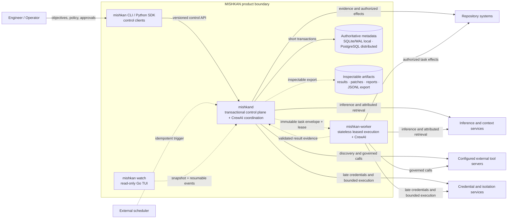
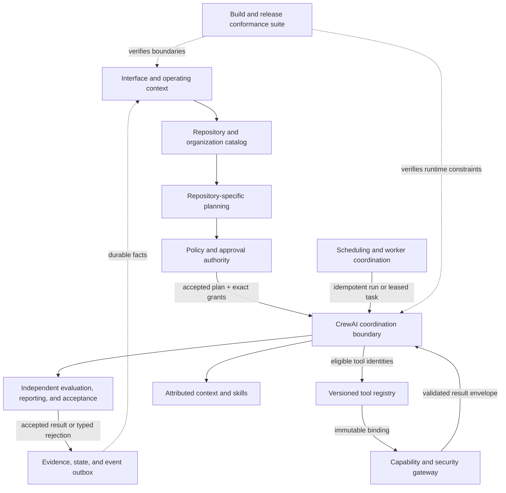

# MISHKAN Architecture

**Status:** Approved — Gate G5

**Version:** 1.0

**Derived from:** Approved System Model 1.0, Responsibility Map 1.0, and D-021

## 1. Scope and rules

This document derives C4 structure from the approved behavior model. It proposes deployment and
component boundaries; it does not authorize implementation. A component is a cohesive ownership
boundary, not automatically a package, process, service, or team.

The following constraints shape every boundary:

- CrewAI 1.x is the sole production runtime for agents, tasks, crews, processes, flows, and model
  tool-calling. MISHKAN supplies policy, evidence, acceptance, and capability enforcement around it;
  it does not create a competing coordination engine.
- An organizational outcome is stable, but its task graph is compiled from the objective,
  repository evidence, applicable organization, capabilities, and effective policy. No universal
  static workflow chain is embedded in the product.
- Operational values—including providers, routes, tools, endpoints, timeouts, retry limits, path
  scopes, isolation profiles, and capability decisions—come from public versioned configuration or
  policy. Code owns schemas and invariants, not a private operational deny-list.
- Stateful effects are governed as `allow`, `require_approval`, or `deny`. Absence of a grant gives
  no authority, but commit, push, deploy, release, and migration are not globally prohibited.
- Authoritative state changes use short transactions. CrewAI execution, model calls, external
  effects, event delivery, projections, and artifact export remain outside those transactions.

## 2. C4 container view

**Question:** Which independently runnable or persisted parts exist, and where is authority held?

| Container | Boundary |
|---|---|
| `mishkan` CLI / SDK | Thin typed clients; never a second policy or coordination implementation |
| `mishkand` | Owns authoritative application decisions, run coordination, scheduling, acceptance, events, and local CrewAI execution |
| `mishkan-worker` | Claims immutable envelopes, executes within granted scope, and returns evidence; owns no plan or policy authority |
| `mishkan watch` | Reconstructs a bounded read model from snapshots and events; initially performs no mutations |
| Authoritative metadata | Stores relational current state and the transactional event outbox behind one repository contract |
| Inspectable artifacts | Holds large task results, patches, reports, and exported event streams referenced from authoritative metadata |

Local, cloud, and hybrid operation use the same logical boundaries even when the daemon, embedded
database, and local execution share one host. Distributed mode changes placement and failure modes,
not authority or acceptance semantics.

## 3. C4 component view: `mishkand`

**Question:** How are the 21 approved responsibilities grouped without duplicating ownership?

Every responsibility has exactly one primary component owner:

| Component | Primary responsibilities |
|---|---|
| Interface and operating context | RSP-001, RSP-002, RSP-003 |
| Repository and organization catalog | RSP-004, RSP-007 |
| Repository-specific planning | RSP-005 |
| Policy and approval authority | RSP-006 |
| CrewAI coordination boundary | RSP-008 |
| Independent evaluation, reporting, and acceptance | RSP-009, RSP-010 |
| Versioned tool registry | RSP-021 |
| Capability and security gateway | RSP-011, RSP-012 |
| Attributed context and skills | RSP-013, RSP-014, RSP-020 |
| Evidence, state, and event outbox | RSP-015 |
| Scheduling and worker coordination | RSP-016, RSP-017 |
| Build and release conformance suite | RSP-018, RSP-019 |

These are modules of one transactional control plane first. They gain process boundaries only when a
required isolation, scaling, or failure-containment property justifies the distributed cost.

## 4. Consistency and effect boundaries

The authoritative metadata transaction includes both the state transition and its outbox fact. It
MUST NOT include model execution or an external effect.

| Consistency boundary | Atomic records |
|---|---|
| Plan acceptance | plan version, repository/discovery fingerprint, policy snapshot, tool/skill bindings, outbox fact |
| Result acceptance | accepted attempt, validated result references, dependency release, outbox fact |
| Approval change | exact authorization scope, decision or revocation, actor evidence, outbox fact |
| Skill activation | inspected staged version, active pointer, provenance lineage, outbox fact |
| Schedule trigger | occurrence identity, overlap decision, at-most-one run identity, outbox fact |
| Worker lease | attempt envelope identity, worker identity, expiry, state transition, outbox fact |

A capability invocation first records an authorized attempt, performs the effect outside the
transaction, and then records a validated terminal result. If completion cannot be established,
the attempt becomes `uncertain`; it is never silently retried unless the tool contract proves the
operation idempotent under the same key.

## 5. Architecture decisions

### ADR-001 — Transactional modular control plane

**Status:** Accepted by D-021

**Decision:** Keep relational current state authoritative and append an event-outbox fact in the
same short transaction. Deliver events, build read projections, run CrewAI, and perform external
effects asynchronously from that boundary.

**Why:** This preserves local-first simplicity and direct invariants without the replay hazards of
full event sourcing or the distributed consistency cost of service-first decomposition.

**Risk control:** Module APIs and ownership tests prevent the daemon from collapsing into shared
mutable internals; transaction-duration and SQLite-contention measurements are release gates.

### ADR-002 — Persistence profiles

**Status:** Accepted by D-015

**Decision:** Use SQLite in WAL mode for local, cloud, and hybrid metadata, and require PostgreSQL
for distributed mode. Both implement the same repository, transaction, lease, and outbox semantics.
Artifact bodies remain inspectable outside relational rows and are referenced with integrity
metadata. Schema migration is an explicit environment-scoped capability operation governed by
policy and approval; startup never mutates an unsupported schema implicitly.

**Consequence:** Distributed support cannot rely on SQLite locking behavior, while local operation
does not require a database service.

### ADR-003 — One control API and resumable observation

**Status:** Accepted by D-016

**Decision:** `mishkand` exposes one versioned `/v1` HTTP control API. CLI, SDK, external scheduler,
and TUI call the same application commands and queries. The TUI obtains a bounded snapshot and then
resumes a typed SSE stream by durable cursor; it is not an authority source.

**Consequence:** Local in-process shortcuts may optimize transport but must pass the same command,
validation, authorization, and error contracts.

### ADR-004 — CrewAI production boundary

**Status:** Accepted by D-016 as the structural realization of D-002

**Decision:** A narrow CrewAI integration materializes accepted MISHKAN organization and plan
versions as supported CrewAI agents, tasks, crews, processes, and flows. MISHKAN does not expose an
alternative production runtime selector. Test doubles replace only externalized runtime ports in
test configuration. Workers use the same supported CrewAI boundary for assigned execution.

**Consequence:** CrewAI runtime identities and outcomes are recorded as lineage, while policy,
capability dispatch, durable evidence, and acceptance remain MISHKAN responsibilities.

### ADR-005 — Versioned external adapter ports

**Status:** Accepted by D-016

**Decision:** Inference, memory, knowledge, structure, external tools, credentials, isolation,
scheduling, and worker transport connect through typed versioned ports selected by effective
configuration. Adapter presence never grants authority. External tool schemas are discovered and
frozen in the accepted task binding before CrewAI receives them.

**Consequence:** Concrete providers and operational limits may evolve without rewriting core
policy or plan semantics, while schema drift produces an explicit blocked or replan state.

## 6. Approval

The engineer accepted the structural baseline on 2026-08-23:

- D-015 accepts ADR-002 persistence profiles;
- D-016 accepts ADR-003 through ADR-005 interface boundaries;
- D-022 closes Gate G5 with System Model 1.0 and Architecture 1.0.

Sequence 06 may now turn the approved responsibilities, behaviors, and boundaries into an
implementation and acceptance plan. This approval does not itself authorize coding.
