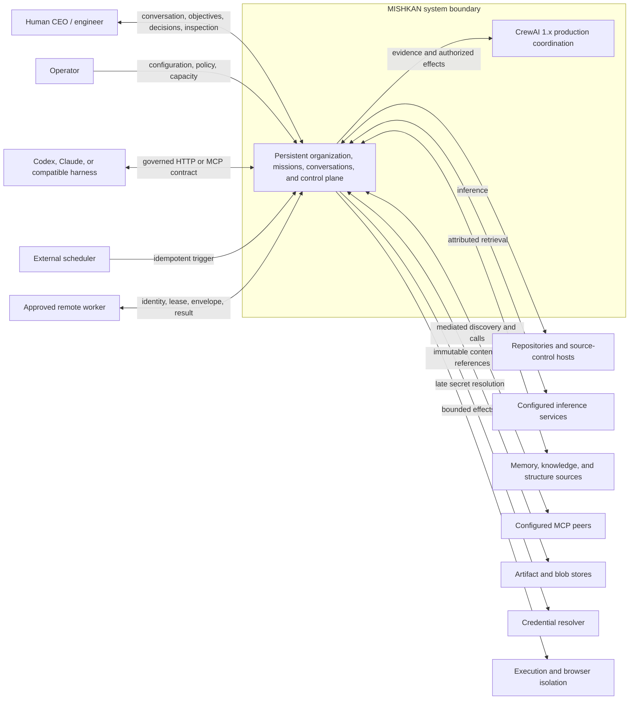
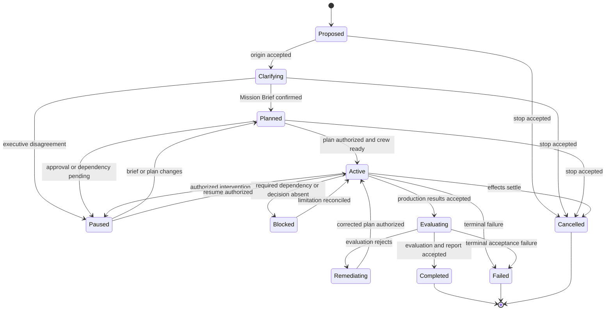
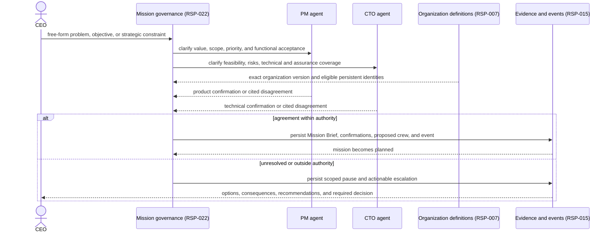
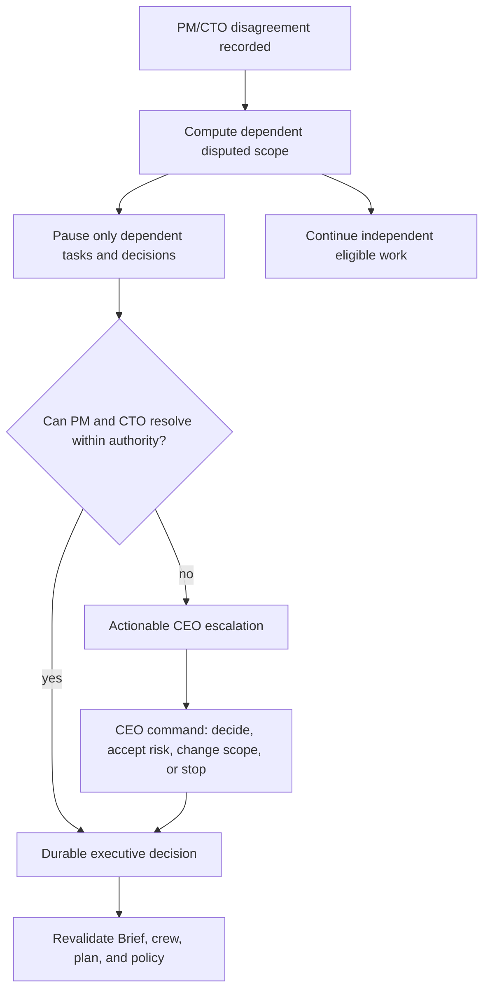
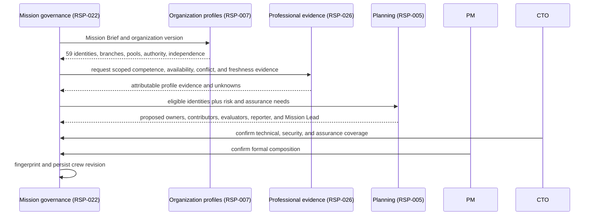
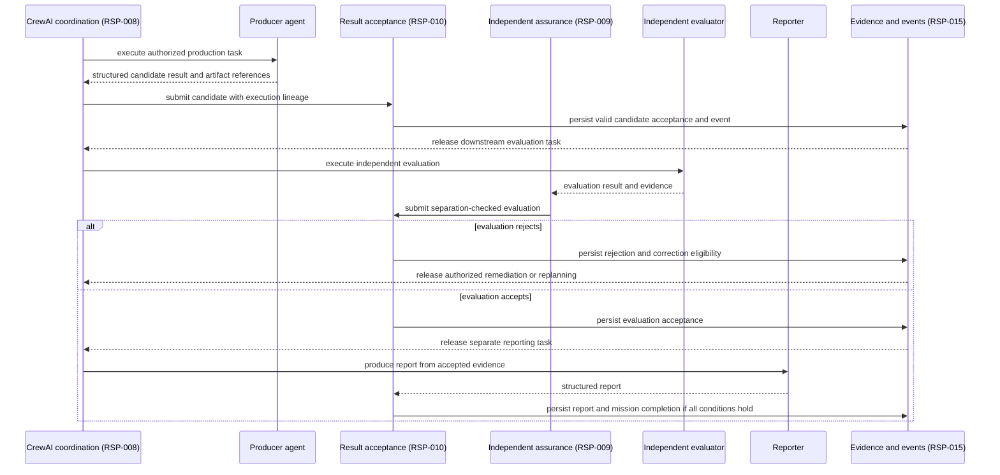
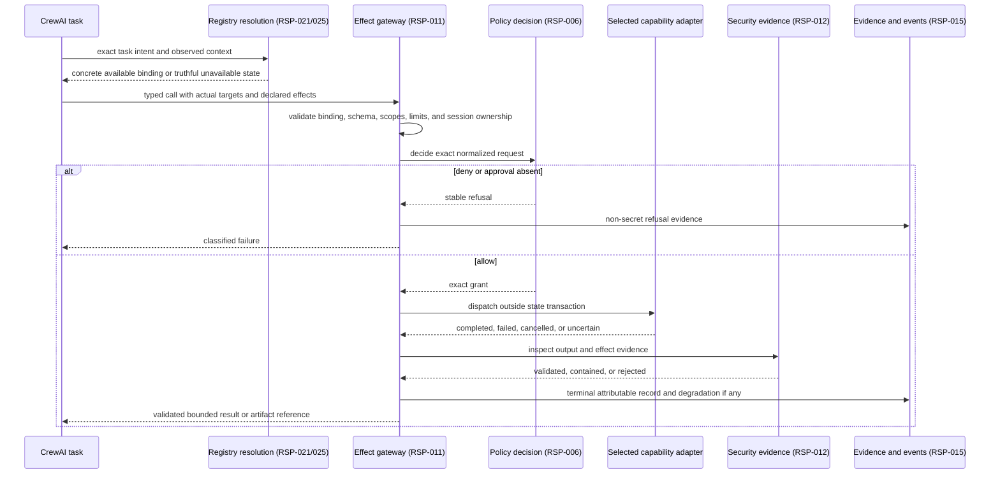
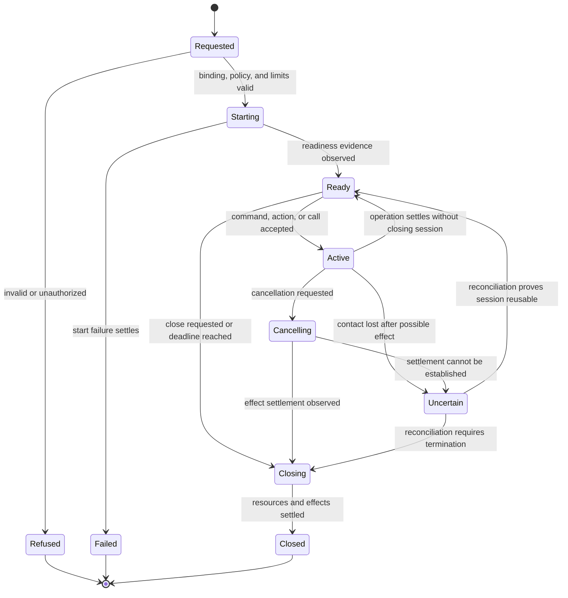
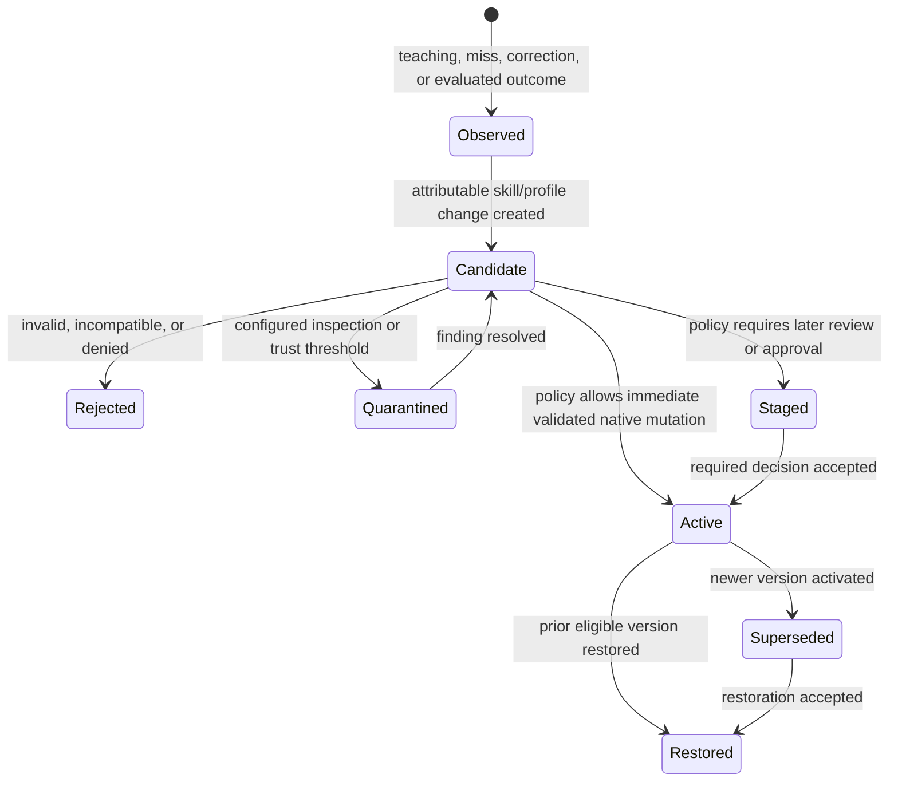
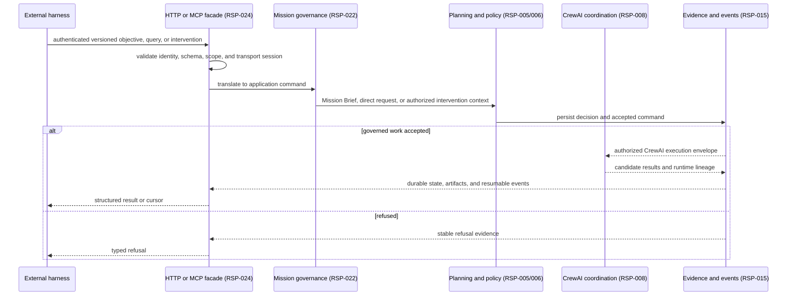

# MISHKAN System Model

**Status:** Proposed amendment — awaiting D-035
**Version:** 1.2
**Derived from:** Proposed PRD 1.4, SRS 1.6, System Contract 1.4, Responsibility Map 1.2

## 1. Purpose and modeling discipline

This document answers only the behavioral questions that constrain architecture. A participant
names an external actor or approved responsibility, not automatically a process, service, package,
database, or protocol. CrewAI is the sole production runtime for agents and teams; MISHKAN owns
deterministic state, policy, effects, evidence, and acceptance around it.

## 2. System context

**Question:** Who interacts with MISHKAN, and which authorities remain outside it?



MISHKAN does not become the repository host, credential authority, model provider, artifact store,
isolation engine, or MCP peer. Availability and instructions from those systems confer no MISHKAN
authority.

## 3. Complete mission lifecycle

**Question:** Which durable states make mission progress and interruption unambiguous?



Every transition records actor or cause, reason, command or decision, organization and Mission Brief
versions, and evidence. Cancellation releases no new task; uncertain effects settle or reconcile
before the terminal record claims completion.

## 4. Mission Brief and PM/CTO agreement

**Question:** What becomes durable before mission planning may begin?



An optional template may contribute guidance and provenance before confirmation. It never supplies
implicit authority, a fixed crew, or a mandatory task graph.

## 5. Disagreement, partial pause, and CEO escalation

**Question:** How does disagreement avoid freezing unrelated work or becoming an implicit decision?



A conversation message or recommendation is not the decision. Only an authorized command changes
mission state.

## 6. Contextual Mission Crew composition

**Question:** How are permanent professional identities composed without a static team matrix?



The Mission Lead is a temporary responsibility assigned to one of the 59 identities. Tools and
skills are selected later for exact tasks; professional identity never implies ambient capability.

## 7. Production, independent evaluation, reporting, and acceptance

**Question:** How does CrewAI coordinate work without owning deterministic acceptance?



CrewAI completion is always a candidate result. Production, evaluation, reporting, and evidence
audit remain separately attributable.

## 8. Common governed capability invocation

**Question:** How do native tools, skills, engines, Web, Browser, artifacts, and MCP share one
authority boundary without becoming one static taxonomy?



Discovery, installation, health, instructions, and credentials never grant authority. Project
commands remain process/Bash inputs, not invented tool identities.

## 9. PTY, job, browser, and MCP session lifecycle

**Question:** How are long-lived state and uncertain effects contained?



Each session has an owner, execution location, scope, cursors, deadlines, resource bounds,
credential references, and lifecycle evidence. Browser authenticated state and MCP/terminal
sessions are never shared implicitly.

## 10. Immutable artifacts and concurrent working references

**Question:** How can large results be durable and collaborative without silent overwrite?

```mermaid
sequenceDiagram
    participant P as Producer
    participant A as Artifact governance (RSP-023)
    participant B as Content-addressed store
    participant M as Metadata transaction
    participant C as Concurrent writer
    P->>A: stream content plus media and provenance contract
    A->>B: write and verify immutable content
    B-->>A: content identity and size
    A->>M: persist manifest and validation state
    P->>A: advance working reference, expected revision r1
    C->>A: advance same reference, expected revision r1
    A->>M: compare r1 and atomically set r2
    M-->>A: success
    A->>M: compare stale r1 with current r2
    M-->>A: conflict; current r2 retained
    A-->>C: deterministic conflict with both immutable revisions
```

Storage success does not equal task acceptance. Missing or corrupt content enters recovery state;
retention and garbage collection preserve protected manifests and evidence.

## 11. Skill and professional-competence evolution

**Question:** How can Hermes-like live improvement remain fluid, reversible, and evidence-based?



Activation policy depends on source, trust, scope, effect, and risk; staging is not universal.
Community discovery remains a candidate. Agent-profile promotion additionally requires scoped
attributable evaluation and cannot alter authority, independence, identity, or failure history.

## 12. External harness request through MISHKAN and CrewAI

**Question:** Where does a machine client request become governed organizational work?



The facade does not expose a runtime selector or a second agent coordinator.

## 13. Resume, scheduling, and worker lease

**Question:** How does asynchronous and distributed execution preserve acceptance semantics?

```mermaid
sequenceDiagram
    participant S as Schedule governance (RSP-016)
    participant V as State and outbox (RSP-015)
    participant C as CrewAI coordination (RSP-008)
    participant D as Worker coordination (RSP-017)
    participant W1 as Worker A
    participant W2 as Worker B
    participant A as Result acceptance (RSP-010)
    S->>V: atomically deduplicate occurrence and create run
    V-->>C: durable eligible task
    C->>D: request eligible remote placement
    D-->>W1: immutable envelope and bounded lease
    Note over W1,D: heartbeat stops; lease expires
    D-->>W2: new attempt envelope and lease
    W2->>A: valid completion
    A->>V: atomically accept first valid completion and release dependencies
    W1->>A: late completion
    A->>V: record stale or duplicate delivery; accepted result unchanged
    Note over C,V: after restart, resume from earliest required result not accepted
```

Scheduling and placement create new delivery and recovery states, never new policy or acceptance
semantics.

## 14. Behavioral conclusions constraining structure

1. One authoritative application domain owns missions, conversations, commands, policy, evidence,
   artifacts, and acceptance for every client.
2. CrewAI remains directly integrated as the only production agent/team runtime.
3. State changes and outbox facts use short consistency boundaries; model execution and external
   effects occur outside them.
4. Mission governance, planning, authorization, effect enforcement, acceptance, artifact storage,
   and projections remain distinct ownership boundaries.
5. Sessions, artifacts, worker leases, attempts, and results have separate identities and
   lifecycles.
6. Optional templates, skills, packs, tools, and engines are contextually resolved inputs, not
   authority or static workflows.
7. Read models and live streams may lag; commands validate against authoritative current state.
8. The accepted structural direction remains a transactional modular monolith with an outbox, not
   full event sourcing or service-first decomposition.

These conclusions supersede the version 1.1 behavior amendment only after D-035. They do not
authorize implementation.
