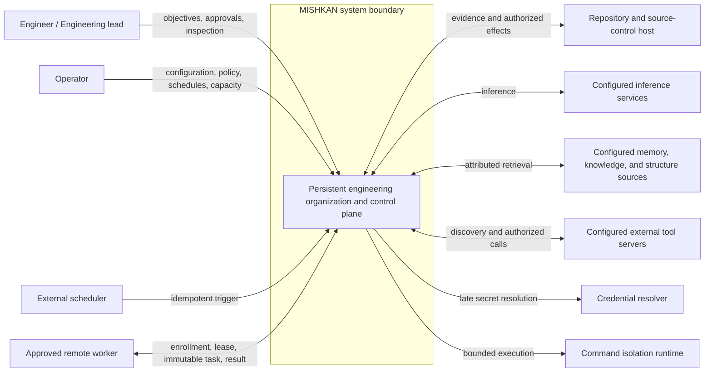
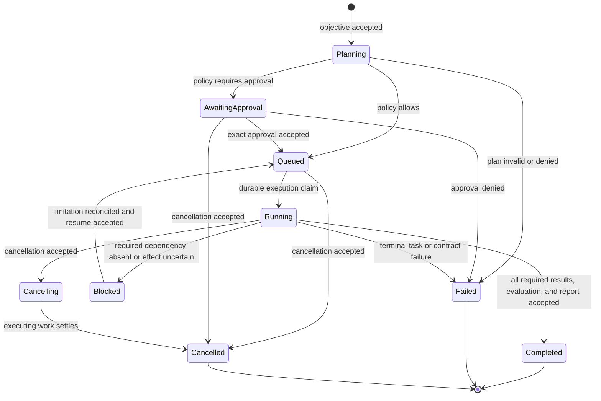
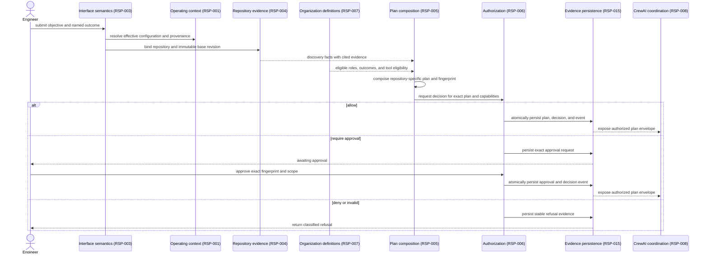
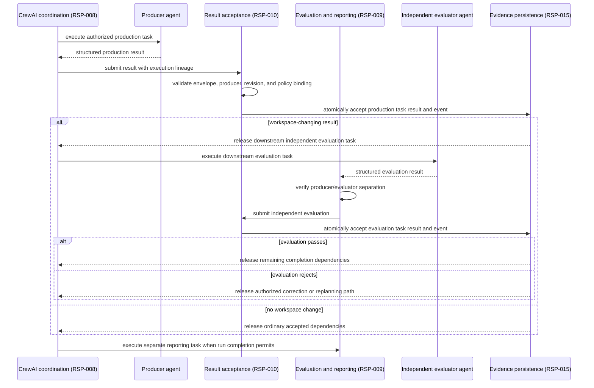
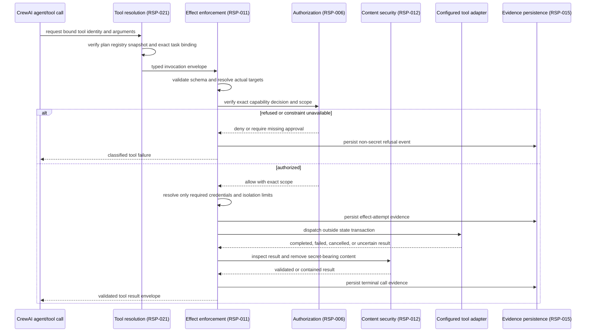
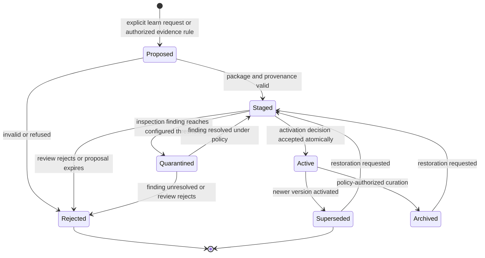
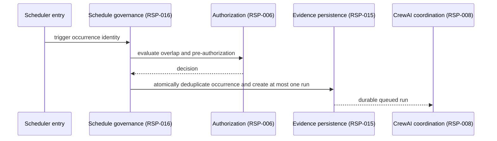

# MISHKAN System Model

**Status:** Approved — Sequence 05 behavioral basis
**Version:** 1.0
**Derived from:** Approved PRD 1.2, SRS 1.3, System Contract 1.2, Responsibility Map 1.0

## 1. Purpose and modeling discipline

This document models the system boundary and the approved behaviors that shape architecture. It
does not by itself approve containers, components, protocols, tables, or Python modules.

The order follows `SWE-BASICS-BEFORE-CODE` Sequence 05:

1. establish the system context boundary;
2. confirm actor goals;
3. model the hardest state transitions and interactions;
4. derive C4 container and component structure only after behavior review.

Every participant below names an approved responsibility or external actor. A responsibility is
not automatically a process or service.

## 2. System context boundary

**Question:** Who interacts with MISHKAN, and which systems remain outside its authority?



MISHKAN coordinates work but does not become the repository host, credential authority, inference
provider, isolation engine, or external tool server. External protections remain authoritative.

## 3. Actor-goal map

**Question:** Does the system boundary cover every approved product use case without introducing a
new product surface?

```mermaid
flowchart TB
    Engineer["Engineer"] --> U1["UC-01 Establish repository organization"]
    Engineer --> U2["UC-02 Delegate objective"]
    Engineer --> U3["UC-03 Coordinate specialized work"]
    Engineer --> U4["UC-04 Enforce human authority"]
    Engineer --> U5["UC-05 Review evidence and progress"]
    Engineer --> U6["UC-06 Survive interruption"]
    Engineer --> U7["UC-07 Preserve knowledge and grow skills"]
    Engineer --> U8["UC-08 Operate headlessly"]
    Operator["Operator"] --> U8
    Operator --> U9["UC-09 Use available execution capacity"]
    Operator --> U10["UC-10 Extend controlled capabilities"]
    Lead["Engineering lead"] --> U5
```



## 4. Run lifecycle

**Question:** When can a run advance, pause, resume, or become terminal?



Cancellation is monotonic: after it is accepted, no new task becomes eligible. `Blocked` is not a
successful terminal state and exposes the exact missing decision, dependency, or reconciliation.

## 5. Task lifecycle and exactly-once acceptance

**Question:** Where are dependency eligibility, validation, retries, leases, and duplicate results
resolved?

```mermaid
stateDiagram-v2
    [*] --> Pending
    Pending --> Eligible: all dependencies durably accepted
    Eligible --> Executing: local execution claimed
    Eligible --> Leased: remote immutable envelope issued
    Leased --> RemoteExecuting: worker begins within valid lease
    Leased --> Eligible: lease expires without accepted result
    Executing --> Validating: result delivered
    Executing --> Failed: terminal execution failure
    RemoteExecuting --> Validating: result delivered within lease
    RemoteExecuting --> Eligible: lease expires; recovery creates new attempt
    RemoteExecuting --> Failed: terminal execution failure
    Validating --> Accepted: envelope and output contracts valid
    Validating --> Rejected: contract invalid
    Rejected --> Eligible: new attempt remains authorized and bounded
    Rejected --> Failed: retry bound exhausted
    Accepted --> Accepted: duplicate completion recorded and ignored
    Pending --> Cancelled: run cancellation
    Eligible --> Cancelled: run cancellation
    Leased --> Cancelled: cancellation settles lease
    Executing --> Cancelled: cancellation acknowledged
    RemoteExecuting --> Cancelled: cancellation or lease settlement
    Accepted --> [*]
    Failed --> [*]
    Cancelled --> [*]
```



The transition to `Accepted`, the accepted result, its typed event, and release of newly eligible
dependents form one consistency boundary. A lease grants bounded execution authority, never result
acceptance authority.

## 6. Objective, plan, and authorization sequence

**Question:** What must become durable before CrewAI may coordinate production work?



CrewAI receives only an authorized immutable execution envelope. It does not create the policy
decision, approve the plan, or mutate the accepted plan fingerprint.

## 7. Production, independent evaluation, and acceptance

**Question:** How does CrewAI remain the production coordinator while acceptance and reporting stay
independent?



A CrewAI completion is a candidate result. Only RSP-010 can make it accepted, and only durable
acceptance releases downstream work. Acceptance of a workspace-changing production task makes its
independent evaluation eligible; it does not permit the run to succeed before that evaluation and
the separate report are accepted.

## 8. Tool invocation boundary

### 8.1 Registry discovery and plan binding

**Question:** How does a dynamic tool source become an exact plan-bound capability without silently
changing existing work?

```mermaid
sequenceDiagram
    actor O as Operator
    participant T as Tool resolution (RSP-021)
    participant V as Evidence persistence (RSP-015)
    participant P as Plan composition (RSP-005)
    participant A as Authorization (RSP-006)

    O->>T: add or update configured tool source
    T->>T: discover, namespace, filter, validate, and detect collisions
    T->>V: atomically persist new immutable registry snapshot and event
    V-->>P: expose catalogue metadata and snapshot identity
    P->>T: resolve task toolsets against exact snapshot
    T-->>P: exact tool identities, versions, and schemas
    P->>A: authorize plan fingerprint including resolved tool binding
    A->>V: persist decision and accepted plan binding
    Note over T,V: later discovery creates another snapshot; this binding does not change
```

### 8.2 Authorized invocation

**Question:** How can CrewAI call a bound tool without owning authorization, credentials, or
effects?



An uncertain state-changing effect blocks dependent acceptance until reconciliation. It is never
automatically retried unless the tool contract establishes safe idempotency, deduplication, or an
authorized compensation rule.

## 9. Plan revision and crash recovery

**Question:** How does a run adapt and resume without replacing its history or repeating accepted
work?

```mermaid
sequenceDiagram
    participant C as CrewAI coordination (RSP-008)
    participant P as Plan composition (RSP-005)
    participant A as Authorization (RSP-006)
    participant R as Result acceptance (RSP-010)
    participant V as Evidence persistence (RSP-015)

    C->>P: validated new evidence requires plan change
    P->>V: load latest authorized plan and accepted results
    P->>P: produce linked revision, diff, and preservation analysis
    P->>A: authorize changed fingerprint and introduced capabilities
    A->>V: persist revision, decision, and event atomically
    V-->>C: new authorized envelope plus preserved-result set
    Note over C,V: process interruption may occur here or during execution
    C->>V: request resumable state after restart
    V-->>R: latest plan, accepted results, open effects, and attempts
    R-->>C: earliest required task without accepted result
    C->>C: resume preserved plan; never silently replan
```

## 10. Skill learning lifecycle

**Question:** How does experience become procedural memory without self-activation?



The learning responsibility may create `Proposed` or `Staged` versions. A currently active version
remains active while another version is staged. Only the separate lifecycle responsibility may
atomically change the active-version pointer after provenance, inspection, compatibility, and
policy checks succeed.

## 11. Headless and distributed extension behavior

### 11.1 Idempotent schedule trigger



### 11.2 Remote lease and duplicate completion

```mermaid
sequenceDiagram
    participant W1 as Worker A
    participant D as Distribution governance (RSP-017)
    participant W2 as Worker B
    participant A as Result acceptance (RSP-010)
    participant V as Evidence persistence (RSP-015)

    W1->>D: claim eligible task
    D-->>W1: immutable envelope and bounded lease
    Note over W1,D: heartbeat stops; lease expires
    W2->>D: claim recovered task
    D-->>W2: new attempt envelope and lease
    W2->>A: valid completion
    A->>V: atomically accept first valid completion
    W1->>A: delayed completion
    A->>V: record duplicate or stale completion
    A-->>W1: ignored; accepted result unchanged
```

Distributed execution changes placement and delivery failure modes, not plan, authorization, tool,
or acceptance semantics.

## 12. Behavioral conclusions constraining structure

The diagrams establish these structural needs without yet choosing containers:

1. CrewAI coordination is separated from plan authorization, effect enforcement, and acceptance.
2. State transitions use short consistency boundaries; model execution and external effects never
   occur inside them.
3. Accepted state and its typed evidence cannot be written independently.
4. Tool resolution and tool dispatch remain separate ownership boundaries.
5. Skill proposal and active-version mutation remain separate ownership boundaries.
6. Schedule occurrence, remote lease, and result acceptance have distinct identities and meanings.
7. Read models and live delivery may lag, but authorization and acceptance never depend on a stale
   projection.

## 13. Candidate architecture direction

Three directions were reviewed before drawing containers:

| Direction | Fit | Principal risk |
|---|---|---|
| Transactional modular control plane | Strong local-first fit | Responsibility leakage inside one process |
| Fully event-sourced core | Strong history, weak present fit | Projection, migration, and non-replayable-effect complexity |
| Service-first control plane | Strong isolation later | Premature distributed consistency and local operational burden |

The accepted direction is a transactional modular control plane with relational authoritative state
and an append-only event outbox written in the same short transaction. CrewAI execution, external
effects, event delivery, JSONL export, and read projection occur outside that transaction. Process
separation is initially limited to interfaces already required by the product, especially remote
workers and the read-only monitor.

D-021 records the engineer's approval of this direction. C4 container and component models may now
derive structure from these behaviors without reopening the accepted runtime or policy boundaries.
